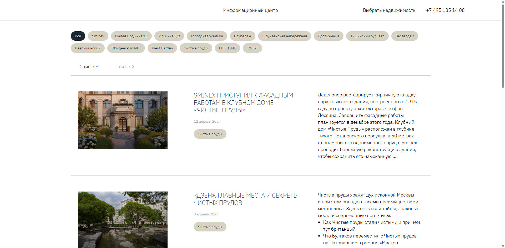
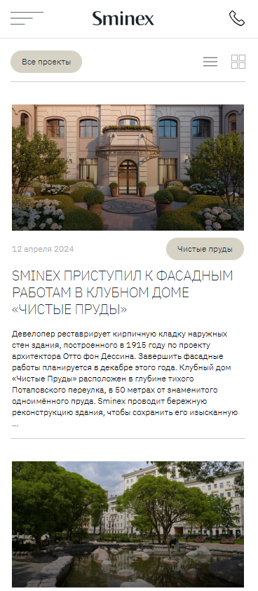

# Responsive Layout for Sminex-Inteko Website

A fully responsive, fluid layout for the information center page, built from a Figma design using the **Desktop First** approach. Features a burger menu, adaptive grid of news cards, and semantic HTML/CSS.

## 🚀 Live Demo  
**[View the live website here](https://kseniiasad.github.io/Responsive-fluid-layout-for-the-Sminex-Inteko-website/)**  

## 📸 Preview  
| Desktop (1728px+) | Mobile (375px) |
|-------------------|----------------|
|  |  |

## 🛠️ Technologies Used  
- **HTML5** (semantic markup, accessibility)  
- **CSS3** (Flexbox, CSS Grid, BEM methodology)  
- **Responsive Design** (Desktop First with breakpoints for tablet and mobile)  
- **Git & GitHub Pages** (deployment)

## ✨ Key Features  
- **Fully Responsive** – optimized for **desktop, tablet, and mobile**.  
- **Desktop First** – developed starting from desktop version with progressive adaptation.  
- **Burger Menu** – interactive mobile navigation.  
- **Fluid Grid Layout** – news cards adapt to all screen sizes.  
- **Layout Corrections** – implemented top borders and full-width cards according to curator feedback.  
- **Pixel-Perfect** – matches the original Figma design across all devices.  

## 📱 Breakpoints  
- **Desktop:** 1728px and above  
- **Tablet:** 874px – 1279px  
- **Mobile:** up to 767px  

## 📁 Project Structure  
Responsive-fluid-layout-for-the-Sminex-Inteko-website/
├── index.html
├── css/
│ └── style.css # Компилированный CSS
├── scss/ # Исходные SCSS файлы
├── fonts/ # Веб-шрифты
├── images/ # Все изображения
│ ├── preview.png # Desktop screenshot
│ ├── preview-mobile.png # Mobile screenshot
│ └── news/ # News article images
└── README.md

## 📬 Contact  
[My GitHub Profile](https://github.com/KseniiaSad)
